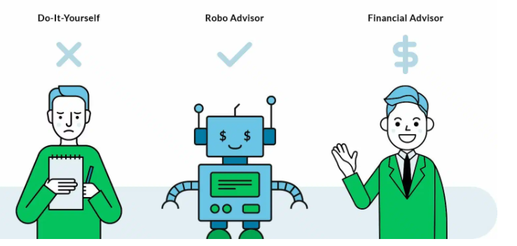
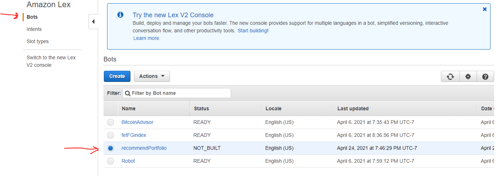
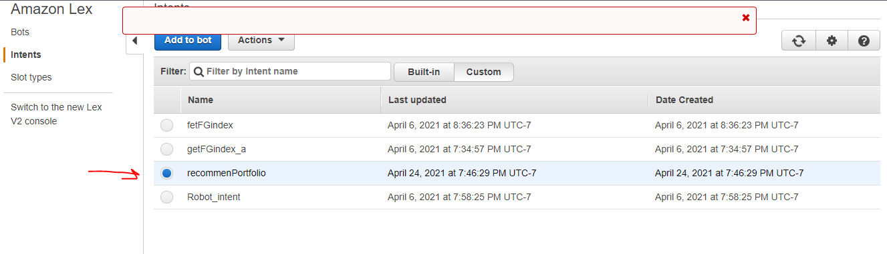
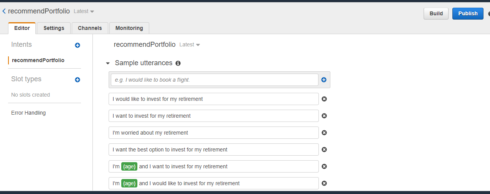
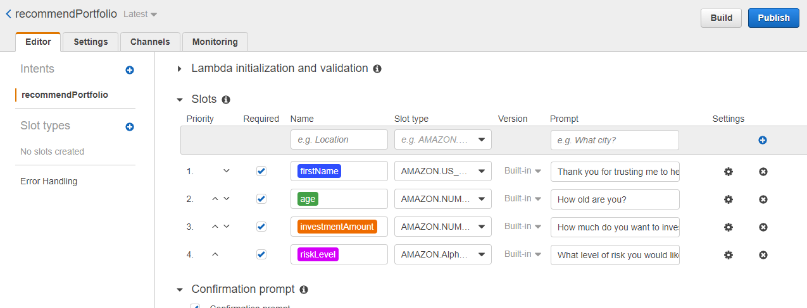
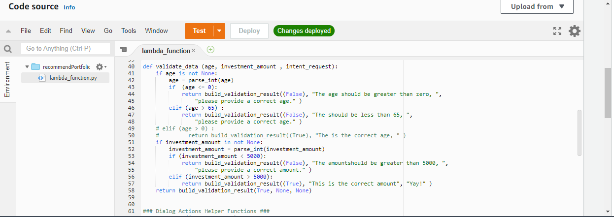
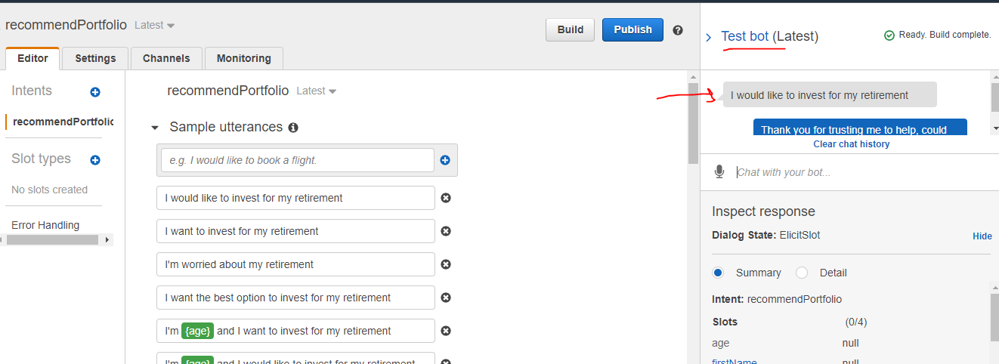

# Robot_advisor

In this use case, one of the most prominent retirement plan providers in the country want to increase their client portfolio—especially by engaging young people. Because machine learning and NLP are disrupting finance to improve the customer experience, I am creating a robo advisor. Both existing and potentially new customers will be able to use this robo advisor to get investment portfolio recommendations for retirement.

-----------------------------------------------------------------------------------------------------------------------------------------------------------------------------

Using AWS bot feature, we created 'bot' name recommendPortforlio.

-----------------------------------------------------------------------------------------------------------------------------------------------------------------------------

Then we created 'intent' name 'recommendPortforlio. . Intent means the objective of the customer.

-----------------------------------------------------------------------------------------------------------------------------------------------------------------------------

Then we created possible list of questions that a user would ask which is also called as 'utterances'.

-----------------------------------------------------------------------------------------------------------------------------------------------------------------------------

These are the input given by the user which is called 'slot types'. There is also a recording on this same which is showing live demo of this robo. 

-----------------------------------------------------------------------------------------------------------------------------------------------------------------------------

These is the code on the backend which is controlling the interactive recommend portfolio

-----------------------------------------------------------------------------------------------------------------------------------------------------------------------------

This shows the interactive bot answering user's questions.

-----------------------------------------------------------------------------------------------------------------------------------------------------------------------------
